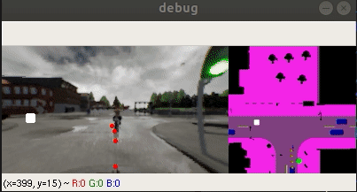

# Learning by Cheating


> [**Learning by Cheating**](https://arxiv.org/abs/1912.12294)    
> Dian Chen, Brady Zhou, Vladlen Koltun, Philipp Kr&auml;henb&uuml;hl,        
> [Conference on Robot Learning](https://www.robot-learning.org) (CoRL 2019)      
> _arXiv 1912.12294_

If you find our repo to be useful in your research, please consider citing our work
```
@inproceedings{chen2019lbc
  author    = {Dian Chen and Brady Zhou and Vladlen Koltun and Philipp Kr\"ahenb\"uhl},
  title     = {Learning by Cheating},
  booktitle = {Conference on Robot Learning (CoRL)},
  year      = {2019},
}
```

## Installation

Clone this repo with all its submodules

```bash
git clone https://github.com/bradyz/2020_CARLA_challenge.git --recursive
```

All python packages used are specified in `carla_project/requirements.txt`.

This code uses CARLA 0.9.9 and works with CARLA 0.9.8.

You will also need to install CARLA 0.9.9, along with the additional maps.
See [link](https://github.com/carla-simulator/carla/releases/tag/0.9.9) for more instructions.


## Installation of Carla 0.9.9
The following commands can be used to install carla 0.9.9

Create a new conda environment:
```
conda create --name carla99 python=3.7
conda activate carla99
```
Download CARLA_0.9.9.tar.gz and AdditionalMaps_0.9.9.tar.gz from [link](https://github.com/carla-simulator/carla/releases/tag/0.9.9) and run
```
mkdir carla_099
tar -xvzf CARLA_0.9.9.tar.gz -C carla_099
```
move AdditionalMaps_0.9.9.tar.gz to Import/ and run:
```
./ImportAssets.sh
```
Then, run
```
cd carla_099/PythonAPI/carla/dist
easy_install carla-0.9.9-py3.7-linux-x86_64.egg
```
Test the installation by running
```
cd ../../..
./CarlaUE4.sh -quality-level=Epic -world-port=2000 -resx=800 -resy=600 -opengl
```


## Dataset

We provide a dataset of over 70k samples collected over the 75 routes provided in `leaderboard/data/routes_*.xml`.

[Link to full dataset (9 GB)](https://drive.google.com/file/d/1dwt9_EvXB1a6ihlMVMyYx0Bw0mN27SLy/view?usp=sharing).



The dataset is collected using `scenario_runner/team_code/autopilot.py`, using painfully hand-designed rules (i.e. if pedestrian is 5 meters ahead, then brake).

Additionally, we change the weather for a single route once every couple of seconds to add visual diversity as a sort of on-the-fly augmentation.
The simulator is run at 20 FPS, and we save the following data at 2 Hz.

* Left, Center, and Right RGB Images at 256 x 144 resolution
* A semantic segmentation rendered in the overhead view
* World position and heading
* Raw control (steer, throttle, brake)

Note: the overhead view does nothing to address obstructions, like overhead highways, etc.

We provide a sample trajectory in `sample_data`, which you can visualize by running

```
python3 -m carla_project.src.dataset sample_data/route_00/
```

## Data Collection
comment out the pretrained model lines in run_agent.sh.

First, spin up a CARLA server

```bash
./CarlaUE4.sh -quality-level=Epic -world-port=2000 -resx=800 -resy=600 -opengl
```

then run the agent.

```bash
./run_agent.sh
```

## Run a pretrained model

Download the checkpoint from our [Wandb project](https://app.wandb.ai/bradyz/2020_carla_challenge_lbc).

Navigate to one of the runs, like https://app.wandb.ai/bradyz/2020_carla_challenge_lbc/runs/command_coefficient=0.01_sample_by=even_stage2/files

Go to the "files" tab, and download the model weights, named "epoch=24.ckpt", and pass in the file path as the `TEAM_CONFIG` below.

comment out the autopilot model lines in run_agent.sh.

Spin up a CARLA server

```bash
./CarlaUE4.sh -quality-level=Epic -world-port=2000 -resx=800 -resy=600 -opengl
```

then run the agent.

```bash
./run_agent.sh
```
